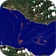

### Hey there 👋 

I'm **Bahri ABACI**, a computer vision enthusiast and Ph.D. student.

📖 My research is all about making computers understand the world like we do, specifically on biometric verification, target tracking and object detection. 

👨‍💻 I speak the language of computers fluently, specifically in **C**, **C++**, **Python** and **Matlab**. 

📝 I also share my knowledge and experiences in the field on my blog, [imlab](https://imlab.io). 

🚀 I organized most of my public repositories under different organizations. Check out my organizations to see what I code!

📌 If you're into computer vision or just want to know more about it, give my [blog](https://imlab.io) a read and follow me!

